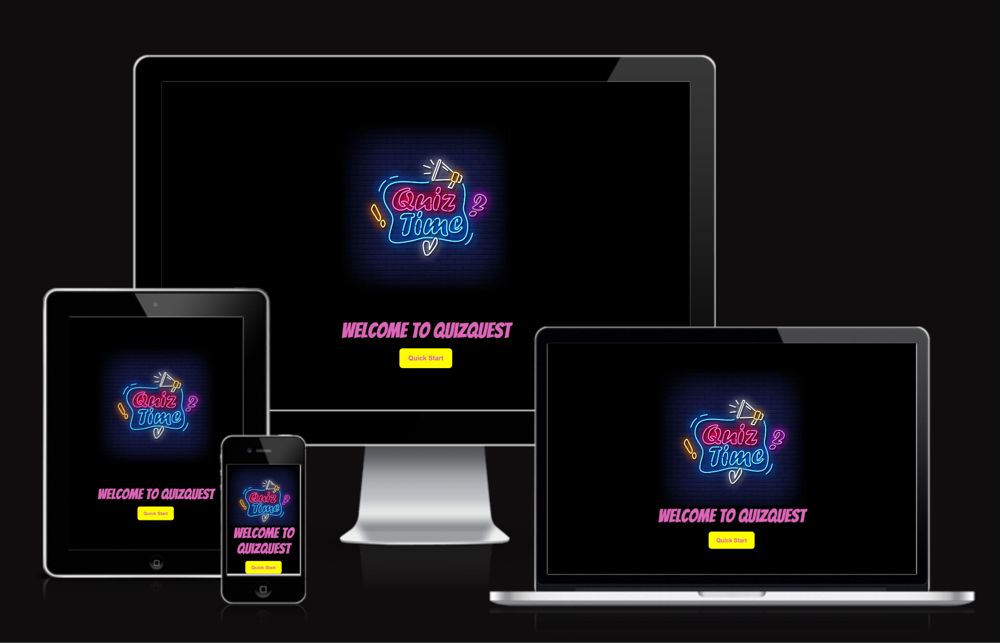
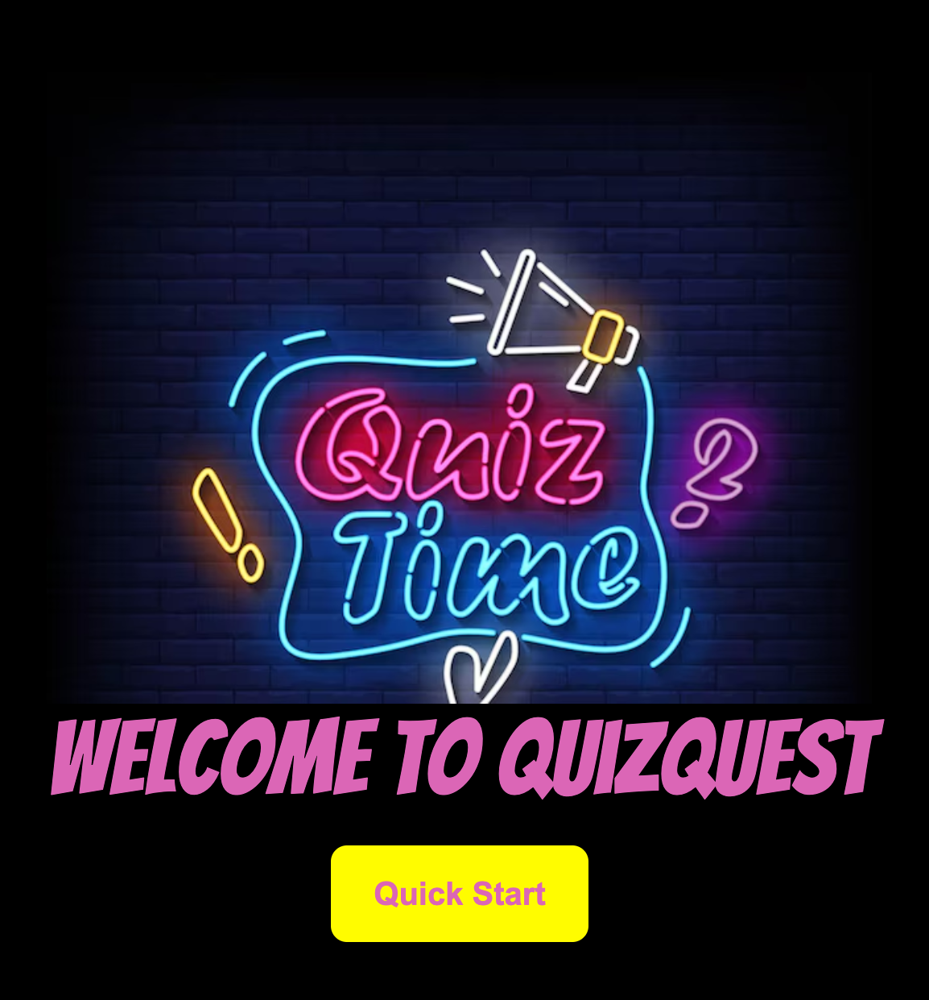
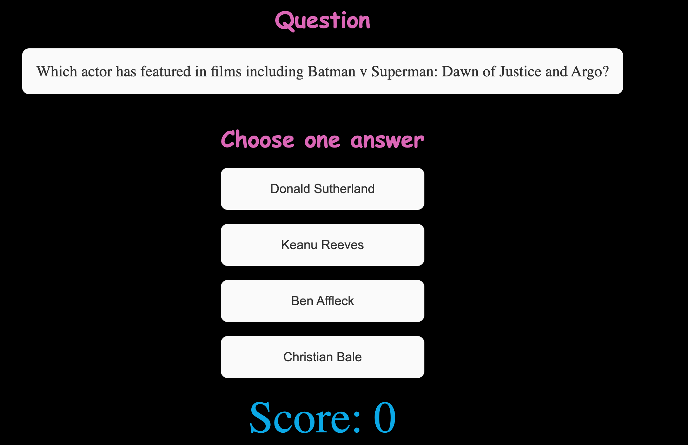
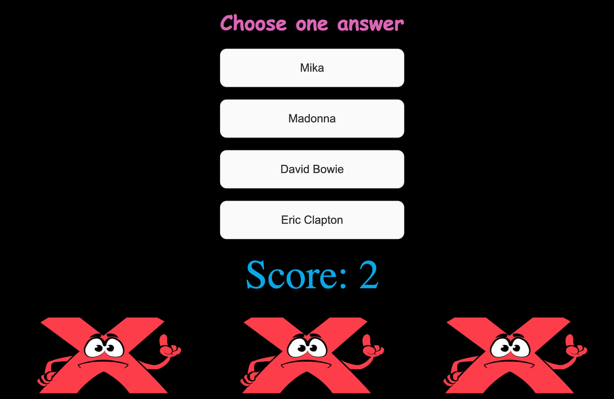
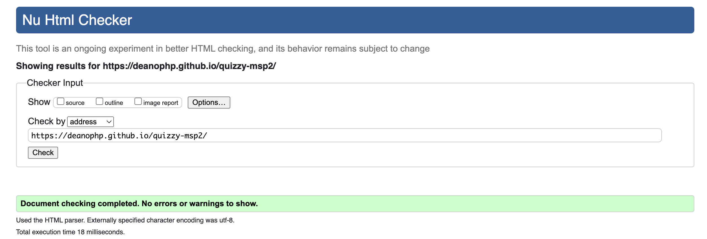
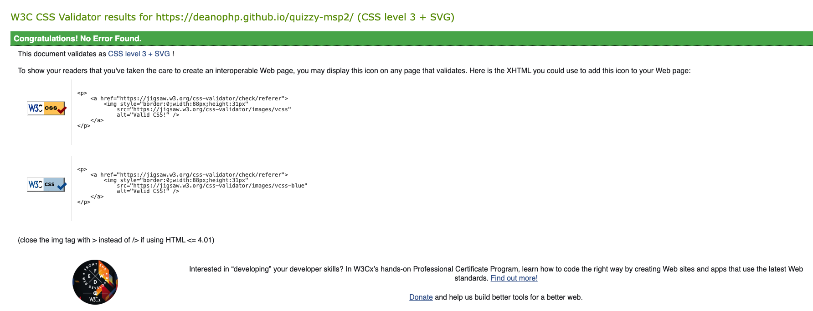
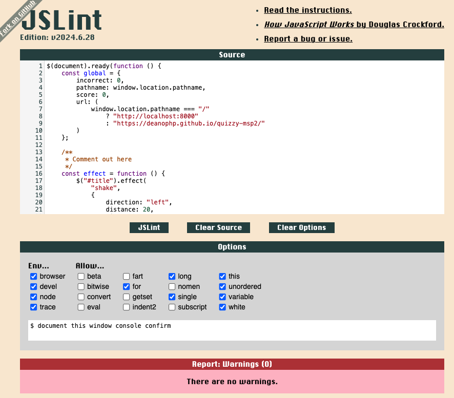

# Quizzy

[Click here to view the live website](https://deanophp.github.io/quizzy-msp2/)

# Overview
Welcome to our engaging trivia game, a fun and interactive way to test your knowledge! Built using HTML, JavaScript, and jQuery, this game connects seamlessly to the Trivia API to deliver a diverse range of questions across various categories. Whether you're a trivia buff or just looking for a quick challenge, this game offers something for everyone.

# Key Features
+ **Dynamic Question Bank:** Leveraging the Trivia API, the game provides a wide array of questions, ensuring each round is unique and challenging.
+ **High Score Tracking:** Your best performance is always within reach. The game saves your highest score in local storage, so you can track your progress over time and aim to beat your personal best.
+ **Three-Strikes Gameplay:** You have three attempts to answer correctly. After three incorrect answers, the game is over, making each question count!
+ **User-Friendly Interface:** With a clean and intuitive design, enhanced with animations, the game is visually appealing and easy to navigate, ensuring a smooth user experience.

# Future Features
+ Give the user the ability to choose between easy, medium, and hard questions
+ Leaderboard Integration
+ Timed Challenges
+ Power-ups and lifelines

# User Experience (UX)
## User Stories

### As a visitor
1. **As a visitor**, I want to start the game quickly, so I can begin answering trivia questions immediately.
2. **As a visitor**, I want to see a question with multiple-choice answers, so I can select what I believe is the correct answer.
3. **As a visitor**, I want to know how many lives I have left, so I can gauge how close I am to losing the game.
4. **As a visitor**, I want to receive immediate feedback when I select an answer, so I know if I was right or wrong.
5. **As a visitor**, I want the game to be over when I lose all my lives, so I can see my final score and possibly play again.
6. **As a visitor**, I want to see my current score during the game, so I can track my progress as I answer questions.
7. **As a visitor**, I want the game to automatically save my top score, so I don't lose my progress when I exit the game.

### As a returning user
1. **As a returning user**, I want to see my top score displayed in the navigation section, so I can compare it with my current game performance.
2. **As a returning user**, I want to continue improving my score, so I can beat my previous high score stored in local storage.
3. **As a returning user**, I want the game to remember my previous top score, so I don't have to start over every time I play.
4. **As a returning user**, I want the option to reset my top score, so I can start fresh if I want to challenge myself anew.

### As a site Owner
1. **As a site owner**, I want the game to be simple and engaging, so users will enjoy playing and come back regularly.
2. **As a site owner**, I want the game to store users' top scores in local storage, so they can track their progress without requiring an account.
3. **As a site owner**, I want the game to load quickly and be responsive, so users have a smooth experience across all devices.
4. **As a site owner**, I want the game to utilize the Trivia API, so the questions are varied and dynamically generated.
5. **As a site owner**, I want the game to provide clear feedback to users, so they are encouraged to keep playing even if they get answers wrong.
6. **As a site owner**, I want to ensure that the game works correctly even if a user closes and reopens the browser, so their high score is preserved.

# Implementation of User Stories
### **Quick Start Implementation**
The "Quick Start" feature allows users to immediately begin playing the trivia game with a single click. Here's how it's implemented:


+ The quick start button included in the game interface. When clicked, it triggers the start of the game.


### **Multiple-Choice Questions Implementation**

The multiple-choice question feature allows users to select the correct answer from several options. Here's how it's implemented:

1. **Question Display:** When the game starts, a trivia question is displayed along with several possible answers.
2. **Answer Options:** The correct answer is mixed with incorrect answers, and all options are presented as clickable buttons.
3. **Shuffling Answers:** The answer options are shuffled to ensure the correct answer appears in a different position each time.
4. **Answer Selection:** When a user clicks on an answer, the game checks if the selected answer is correct.
5. **Feedback and Scoring:** Based on the user's selection, the game provides immediate feedback, updates the score, and adjusts the remaining lives.


### **Lives Tracking Implementation**
The incorrect answer indicator feature visually displays the number of wrong answers by revealing images at the bottom of the game interface. Here's how it's implemented:

1. **Hidden Images:** Three <div> elements with the class .cross-box are placed at the bottom of the game interface. These divs are initially set to `visibility: hidden` in the CSS.
      ```
      .cross-box {
          width: 100%;
          height: 100%;
          background-image: url('../images/incorrect-removebg.png');
          background-size: 100% 100%;
          visibility: hidden;
      }
      ```
2. **Tracking Wrong Answers**
Each time the user selects an incorrect answer, a counter increases, and the corresponding .cross-box becomes visible.

3. **Revealing Images**
As the counter increases with each wrong answer, the visibility of the respective .cross-box changes from hidden to visible, displaying the image.
    ```
    const showIncorrectAnswers = () => {
        const crossbox = $('.cross-box');
        
        if (global.incorrect < crossbox.length) {
            $(crossbox[global.incorrect]).css({
                visibility: 'visible'
            });
            // Increment incorrect count
            global.incorrect++;
        } 
    
        if (global.incorrect > 2) {
            console.log('Game Over');
    
            // Optionally, reset any visual indicators here
            $('.choice-btn').css({
                background: '#fafafa',
                color: '#333'
            });
    
            setTimeout(() => {
                $('.cross-box').css({
                    visibility: 'hidden'
                })
            }, 2000)

            setTimeout(() => {
                gameOver()
            }, 3000)
            
        } 
    }  
    ```
4. **Game Feedback:** This visual feedback helps users immediately understand how many mistakes they've made and how close they are to losing the game.


### **Immediate Feedback Implementation**
1. **Answer Function:** When a user selects an answer, the game immediately checks whether the selected answer is correct or incorrect.
    ```
    const checkAnswers = (correctAnswer) => {
            // .off('click') removes any existing click events
            // .on('click') attaches a new event to the btn
            // .prop('disabled': true) means the button is disabled
            $('.choice-btn').off('click').on('click', function() {

                $('.choice-btn').off('click').prop('disabled', true);
        
                if ($(this).text() === correctAnswer) {
                    $(this).css({
                        background: 'green',
                        color: '#fafafa'
                    });
        
                    correctSound.play();

                    global.score++
                } else {
                    $(this).css({
                        background: 'red',
                        color: '#fafafa'
                    });

                    // Highlight the correct answer
                    setTimeout(() => {
                        $('.choice-btn').each(function(index, ans) {
                            if ($(ans).text() === correctAnswer) {
                                $(ans).css({
                                    background: 'green',
                                    color: '#fafafa'
                                });
                            }
                        });
                    }, 1000);
                    
                    incorrectSound.play();

                    showIncorrectAnswers()                
                }
        
                // Wait for 3 seconds and then start a new game round
                setTimeout(() => {
                    startGame();
                }, 3000); 
            });
        }
    ```
2. **Visual Cues:** The feedback is enhanced with visual cues such as changing the text color (e.g., green for correct, red for incorrect) or showing an animation.

4. **Next Steps:** After displaying the feedback, the game automatically proceeds to the next question or updates the game state (e.g., reducing lives for an incorrect answer).

###  User Story Implementation: Show Current Score While Playing
To display the current score during the game, I have implemented a global **score** variable. Each time the user answers a question correctly, the **global.score** variable is incremented. This updated score is then dynamically displayed in the game by targeting the relevant HTML element using its ID, and updating its content to reflect the current score. This allows the user to see their score in real-time as they progress through the quiz.

### User Story Implementation: Save and Manage User Score
To enhance the user experience, I have implemented functionality to save the user's score in localStorage. After each game, the current score is compared to the saved top score, and if the new score is higher, it is stored as the new top score in localStorage. This ensures that the user’s highest score is preserved and displayed across sessions, allowing them to track their progress.

Additionally, I’ve provided users with the ability to delete their stored top score. This is achieved through a submit button, which, when clicked, prompts the user to confirm the deletion. If confirmed, the top score is removed from localStorage, giving users control over their saved data.

# Skeleton

# Technologies and tools used
+ **HTML5:** For the basic structure.
+ **CSS3:** For styling the website.
+ **JavaScript:** For dynamic content and interactivity
+ **jQuery:** For effects and dynamic content.
+ **The Trivia Quiz API:** For fetching data.
+ **Balsamiq:** For creating wireframes.
+ **Visual Studio:** As a code editor.
+ **Github** For version control and collaboration.
+ **Gitpod** For cloud based development environment.

# Design Overview
The website consists of two primary pages: index.html and game.html.
+ The index page features a simple, black background with a vibrant, eye-catching image that reads "Quiz Time" to reflect the game's title, Quizzy. The image incorporates a color palette of pink, blue, yellow, and white, which is carried throughout the site for a cohesive design.

+ Color scheme:
  - H1 tags: rgb(219, 102, 182)
  - P tags: rgb(11, 168, 230)
  - Font color: #fafafa
  - Body background: Black

On the game page, users answer quiz questions by selecting from four buttons. Interaction feedback includes:

+ Correct answer: The selected button turns green, and a confirmation sound plays.
+ Incorrect answer: The selected button turns red, and after a brief pause, the correct answer is highlighted in green. Additionally, an image of a cross appears at the bottom of the screen to indicate the wrong answer.

The user has three chances before the game ends, with a cross image appearing each time an incorrect answer is given.

The website is fully responsive across all devices and browsers, utilizing Flexbox for layout positioning. The project is built using HTML, CSS, jQuery, and JavaScript.

# Testing
## Functional Testing
| Action | Expected Behaviour | Pass/Fail |
|--------|--------------------|-----------|
| Initial page load | the page should load on the index.html page | Pass | 
| Click quick start button | When the user clicks the **Quick Start** button, an audio sound should play before the user is redirected to the game.html page. | Pass |
| Upon Redirect to Game Page | After being redirected to the game.html page, the game interface should load immediately, displaying the first quiz question along with four answer options. The user’s current score and remaining attempts should also be visible at this point. | Pass |
| After Correct Answer | When the user selects the correct answer, the selected button should turn green, and a confirmation sound should play. The user's score is then incremented, and the updated score is displayed on the screen. The next question should load immediately after the feedback. | Pass |
| After Incorrect Answer | When the user selects an incorrect answer, the selected button should turn red. After a brief delay, the correct answer will be highlighted by turning its button green. An image of a cross will appear at the bottom of the screen to indicate the incorrect response.  The next question will load once the feedback is displayed. | Pass |
| Game Finished | Once the user has used all their lives, the game will end. A pop-up screen will briefly appear, displaying the user's final score along with a message. After a few seconds, the user will be automatically redirected back to the index page, where they can choose to start the game again. | Pass |

## HTML Test 


## CSS testing


## Testing with JSLint


# Deployment
1. **Design the Website on GitPod**:
   - Open GitPod and create a new workspace.
   - Design and develop your website within the GitPod environment.

2. **Push the Website to GitHub**:
   - Initialize a Git repository in your GitPod workspace:
     ```sh
     git init
     ```
   - Add all the project files:
     ```sh
     git add .
     ```
   - Commit the changes with a meaningful message:
     ```sh
     git commit -m "Initial commit"
     ```
   - Add your GitHub repository as a remote:
     ```sh
     git remote add origin <your-github-repo-url>
     ```
   - Push the changes to GitHub:
     ```sh
     git push -u origin main
     ```
## Cloning this repository

1. Open your prefered terminal.

2. Navigate to the directory where you want the cloned directory to be added.

3. Run the following command 
```sh
git clone https://github.com/DeanoPHP/quizzy-msp2
```

4. After cloning, navigate into the directory
```sh
 cd your-repository-name
```

5. Now you can start working on the project on your local machine.

## Forking this repository
1. Go to the repository on GitHub.

2. In the top-right corner of the page, click the "Fork" button.

3. Once the repository has been forked, you will be taken to your copy of the repository in your GitHub account.

4. Clone your forked repository to your local machine:
```sh
git clone https://github.com/DeanoPHP/quizzy-msp2
```

5. Navigate to the cloned directory
```sh
  cd your-repository-name
```

6. You can now make changes to your fork and submit pull requests to the original repository.

## Deployment Steps
<hr>

**Deploy to GitHub Pages**:
   - Go to your GitHub repository on GitHub.
   - Navigate to the repository settings.
   - Scroll down to the "GitHub Pages" section.
   - Under "Source", select the branch you want to deploy (usually `main` or `gh-pages`).
   - Click "Save".

Your website should now be live on GitHub Pages. You can access it via the URL provided in the GitHub Pages section of your repository settings.

# Credits and Acknowledgments
I would like to express my heartfelt gratitude to my mentor for his invaluable guidance and advice throughout this project.
Additionally, I extend my sincere thanks all my tutors for their exceptional teaching and encouragement. Your dedication and expertise have greatly contributed to my learning journey, Thank you.